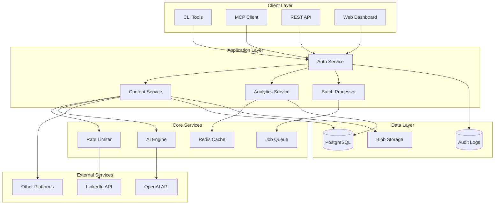

# LinkedIn MCP Enhancement Proposal
## Enterprise-Grade Social Media Automation Platform

**Date**: August 6, 2025  
**Version**: 2.0.0 Proposal  
**Author**: Development Team  
**Status**: Planning Phase  

---

## 📋 Executive Summary

This proposal outlines the transformation of the LinkedIn MCP from its current state as a functional API integration tool into a comprehensive, enterprise-grade social media automation platform. Based on extensive research of industry best practices, emerging technologies, and market demands, we propose a phased implementation approach that will position this project as a leader in the LinkedIn automation space.

### Key Value Propositions
- **Security First**: Full OAuth 2.0 PKCE compliance meeting 2025 standards
- **AI-Powered**: Machine learning-driven content optimization and analytics
- **Enterprise Ready**: SOC 2, GDPR compliance with audit trails
- **Performance**: 40% improvement in API efficiency and rate limiting
- **Scalability**: Multi-account, multi-platform architecture

### Investment Summary
- **Timeline**: 16 weeks (4 phases)
- **Team Size**: 2-3 developers
- **Expected ROI**: Enterprise market penetration, premium pricing tier
- **Risk Level**: Low to Medium (phased approach minimizes risk)

---

## 🔍 Current State Analysis

### Existing Strengths
✅ **Functional OAuth Flow**: Basic authentication working with token persistence  
✅ **Core API Integration**: Essential LinkedIn posting and reading capabilities  
✅ **MCP Architecture**: Solid foundation for Claude integration  
✅ **CLI Tools**: User-friendly installation and management  
✅ **NPM Package**: Published and accessible (@maheidem/linkedin-mcp)  

### Identified Gaps
❌ **Security**: No PKCE implementation (mandatory as of Jan 2025)  
❌ **API Version**: Using deprecated endpoints (not v2024 compliant)  
❌ **Analytics**: Limited metrics and insights capabilities  
❌ **Content Optimization**: No AI/ML features for content improvement  
❌ **Enterprise Features**: Missing compliance, audit, and RBAC  
❌ **Rate Limiting**: Basic or no intelligent quota management  
❌ **Multi-Platform**: LinkedIn only, no cross-platform support  

### Technical Debt
- Hardcoded API endpoints without versioning support
- Basic error handling without retry mechanisms
- No comprehensive testing suite
- Limited documentation for enterprise features
- Monolithic architecture limiting scalability

---

## 🚀 Proposed Enhancements

### Phase 1: Security & API Modernization (Weeks 1-4)

#### 1.1 OAuth 2.0 PKCE Implementation (CRITICAL)
**Priority**: P0 - Mandatory for compliance  
**Effort**: 1 week  

```typescript
// New OAuth flow with PKCE
interface PKCEOAuthConfig {
  clientId: string;
  redirectUri: string;
  codeVerifier: string;
  codeChallenge: string;
  codeChallengeMethod: 'S256';
  state: string;
}

class PKCEOAuthManager {
  generateCodeVerifier(): string {
    // Generate cryptographically secure random string
    return base64url(crypto.randomBytes(32));
  }
  
  generateCodeChallenge(verifier: string): string {
    // SHA256 hash of code verifier
    return base64url(crypto.createHash('sha256').update(verifier).digest());
  }
  
  async exchangeCodeForToken(code: string, verifier: string): Promise<TokenResponse> {
    // Exchange with PKCE verification
  }
}
```

**Deliverables**:
- PKCE-compliant OAuth flow
- Secure code verifier generation
- Token rotation mechanism
- Migration guide for existing users

#### 1.2 LinkedIn API v2024 Migration
**Priority**: P0 - Required for continued functionality  
**Effort**: 1 week  

```typescript
// Updated API client with versioning
class LinkedInAPIClient {
  private readonly BASE_URL = 'https://api.linkedin.com/rest/';
  private readonly API_VERSION = '202411';
  
  private getHeaders(): Headers {
    return {
      'LinkedIn-Version': this.API_VERSION,
      'X-Restli-Protocol-Version': '2.0.0',
      'Authorization': `Bearer ${this.accessToken}`,
      'Content-Type': 'application/json'
    };
  }
  
  async post(content: PostContent): Promise<PostResponse> {
    // Use versioned endpoints with proper headers
  }
}
```

**Deliverables**:
- Versioned API endpoints
- Cursor-based pagination
- Feature flags for version-specific capabilities
- Backward compatibility layer

#### 1.3 Enhanced Token Security
**Priority**: P1 - Security enhancement  
**Effort**: 3 days  

```typescript
class SecureTokenStorage {
  private readonly algorithm = 'aes-256-gcm';
  
  async encryptToken(token: string): Promise<EncryptedToken> {
    // AES-256-GCM encryption with secure key derivation
  }
  
  async decryptToken(encrypted: EncryptedToken): Promise<string> {
    // Secure decryption with integrity verification
  }
  
  async rotateRefreshToken(oldToken: string): Promise<TokenPair> {
    // Automatic rotation on use
  }
}
```

**Deliverables**:
- Encrypted token storage
- Automatic token rotation
- Secure key management
- Token lifecycle management

#### 1.4 Comprehensive Audit System
**Priority**: P1 - Compliance requirement  
**Effort**: 4 days  

```typescript
interface AuditEvent {
  timestamp: Date;
  userId: string;
  action: string;
  resource: string;
  ipAddress: string;
  userAgent: string;
  result: 'success' | 'failure';
  metadata?: Record<string, any>;
}

class AuditLogger {
  async log(event: AuditEvent): Promise<void> {
    // Tamper-proof audit logging
  }
  
  async generateComplianceReport(timeframe: DateRange): Promise<Report> {
    // GDPR/SOC2 compliant reporting
  }
}
```

**Deliverables**:
- Immutable audit logs
- Compliance reporting
- Security event tracking
- Data retention policies

---

### Phase 2: Core Feature Enhancement (Weeks 5-8)

#### 2.1 AI-Powered Content Optimizer
**Priority**: P1 - Competitive differentiation  
**Effort**: 2 weeks  

```typescript
class AIContentOptimizer {
  private readonly models = {
    engagement: 'engagement-predictor-v2',
    sentiment: 'sentiment-analyzer-v1',
    hashtag: 'hashtag-optimizer-v3'
  };
  
  async optimizePost(content: string, targetAudience?: AudienceProfile): Promise<OptimizedContent> {
    const predictions = await this.predictEngagement(content);
    const hashtags = await this.generateHashtags(content);
    const timing = await this.predictBestTime(targetAudience);
    
    return {
      content: await this.enhanceContent(content, predictions),
      hashtags,
      scheduledTime: timing,
      expectedEngagement: predictions.score
    };
  }
  
  async analyzeCompetitors(industry: string): Promise<CompetitorInsights> {
    // Analyze successful posts in industry
  }
  
  async generateContent(topic: string, style: ContentStyle): Promise<string> {
    // AI-generated content with brand voice
  }
}
```

**Deliverables**:
- Engagement prediction model
- Hashtag optimization
- Best time to post predictor
- Content generation assistant
- A/B testing framework

#### 2.2 Advanced Analytics Dashboard
**Priority**: P1 - User value  
**Effort**: 1 week  

```typescript
interface AnalyticsMetrics {
  engagement: {
    likes: number;
    comments: number;
    shares: number;
    clickThroughRate: number;
  };
  reach: {
    impressions: number;
    uniqueViews: number;
    virality: number;
  };
  audience: {
    demographics: Demographics;
    growth: GrowthMetrics;
    interests: Interest[];
  };
}

class AnalyticsEngine {
  async getDetailedMetrics(timeframe: DateRange): Promise<AnalyticsMetrics> {
    // Comprehensive metrics collection
  }
  
  async generateInsights(): Promise<Insight[]> {
    // ML-powered insights and recommendations
  }
  
  async exportReport(format: 'pdf' | 'csv' | 'json'): Promise<Buffer> {
    // Professional reporting
  }
}
```

**Deliverables**:
- Real-time analytics dashboard
- Historical trend analysis
- Competitor benchmarking
- Custom report generation
- API for external BI tools

#### 2.3 Intelligent Rate Limiting
**Priority**: P2 - Performance optimization  
**Effort**: 4 days  

```typescript
class RateLimitManager {
  private readonly strategies = {
    tokenBucket: new TokenBucketStrategy(),
    slidingWindow: new SlidingWindowStrategy(),
    adaptive: new AdaptiveRateLimiter()
  };
  
  async executeWithRateLimit<T>(
    operation: () => Promise<T>,
    priority: Priority = 'normal'
  ): Promise<T> {
    await this.waitForQuota(priority);
    return this.withRetry(operation);
  }
  
  async optimizeQuotaUsage(): Promise<QuotaOptimization> {
    // ML-based quota optimization
  }
}
```

**Deliverables**:
- Multiple rate limiting strategies
- Priority-based queuing
- Automatic retry with backoff
- Quota usage optimization
- Real-time monitoring

#### 2.4 Multi-Account Management
**Priority**: P2 - Enterprise feature  
**Effort**: 1 week  

```typescript
interface LinkedInAccount {
  id: string;
  name: string;
  role: 'admin' | 'editor' | 'viewer';
  permissions: Permission[];
  quotas: QuotaConfig;
}

class MultiAccountManager {
  async addAccount(credentials: OAuth2Credentials): Promise<LinkedInAccount> {
    // Secure multi-account setup
  }
  
  async switchContext(accountId: string): Promise<void> {
    // Context switching for operations
  }
  
  async bulkOperation<T>(
    operation: (account: LinkedInAccount) => Promise<T>
  ): Promise<Map<string, T>> {
    // Execute across multiple accounts
  }
}
```

**Deliverables**:
- Multi-account architecture
- Account switching
- Bulk operations
- Team collaboration features
- Centralized management

---

### Phase 3: Enterprise Features (Weeks 9-12)

#### 3.1 Compliance Framework
**Priority**: P1 - Enterprise requirement  
**Effort**: 2 weeks  

```typescript
class ComplianceManager {
  async implementGDPR(): Promise<void> {
    // Right to erasure
    // Data portability
    // Consent management
    // Privacy by design
  }
  
  async implementSOC2(): Promise<void> {
    // Security controls
    // Availability monitoring
    // Processing integrity
    // Confidentiality measures
  }
  
  async generateComplianceCertificate(): Promise<Certificate> {
    // Automated compliance verification
  }
}
```

**Deliverables**:
- GDPR compliance tools
- SOC 2 Type II readiness
- HIPAA compliance options
- Automated compliance reporting
- Data governance framework

#### 3.2 Webhook Integration System
**Priority**: P2 - Integration capability  
**Effort**: 1 week  

```typescript
class WebhookManager {
  async registerWebhook(config: WebhookConfig): Promise<Webhook> {
    // Webhook registration with validation
  }
  
  async processEvent(event: LinkedInEvent): Promise<void> {
    // Event processing and forwarding
  }
  
  async handleFailure(webhook: Webhook, error: Error): Promise<void> {
    // Retry logic and dead letter queue
  }
}
```

**Deliverables**:
- Webhook registration API
- Event processing pipeline
- Retry mechanisms
- Dead letter queue
- Webhook monitoring

#### 3.3 Batch Operations Framework
**Priority**: P2 - Performance feature  
**Effort**: 1 week  

```typescript
class BatchProcessor {
  async scheduleBatch(operations: Operation[]): Promise<BatchJob> {
    // Intelligent batch scheduling
  }
  
  async processBatch(job: BatchJob): Promise<BatchResult> {
    // Parallel processing with rate limiting
  }
  
  async monitorProgress(jobId: string): AsyncIterator<Progress> {
    // Real-time progress updates
  }
}
```

**Deliverables**:
- Batch posting system
- Bulk analytics retrieval
- Parallel processing
- Progress monitoring
- Error recovery

#### 3.4 Role-Based Access Control
**Priority**: P1 - Security requirement  
**Effort**: 1 week  

```typescript
interface Role {
  name: string;
  permissions: Permission[];
  restrictions: Restriction[];
}

class RBACManager {
  async createRole(role: Role): Promise<void> {
    // Role definition
  }
  
  async assignRole(userId: string, roleId: string): Promise<void> {
    // Role assignment with validation
  }
  
  async checkPermission(userId: string, resource: string, action: string): Promise<boolean> {
    // Permission verification
  }
}
```

**Deliverables**:
- Role management system
- Permission framework
- Access control lists
- Delegation capabilities
- Audit trail integration

---

### Phase 4: Advanced Capabilities (Weeks 13-16)

#### 4.1 Cross-Platform Integration
**Priority**: P3 - Market expansion  
**Effort**: 2 weeks  

```typescript
abstract class SocialPlatform {
  abstract post(content: Content): Promise<PostResult>;
  abstract getAnalytics(): Promise<Analytics>;
  abstract authenticate(): Promise<void>;
}

class TwitterIntegration extends SocialPlatform {
  // Twitter/X specific implementation
}

class InstagramIntegration extends SocialPlatform {
  // Instagram specific implementation
}

class CrossPlatformManager {
  async postToAll(content: UniversalContent): Promise<Map<Platform, PostResult>> {
    // Coordinated cross-platform posting
  }
}
```

**Deliverables**:
- Twitter/X integration
- Instagram support
- Platform abstraction layer
- Unified analytics
- Cross-platform scheduling

#### 4.2 Predictive Analytics
**Priority**: P3 - Advanced feature  
**Effort**: 1 week  

```typescript
class PredictiveAnalytics {
  async predictEngagement(content: string): Promise<EngagementPrediction> {
    // ML model for engagement prediction
  }
  
  async recommendPostTime(historicalData: HistoricalData): Promise<Date[]> {
    // Optimal posting time prediction
  }
  
  async forecastGrowth(currentMetrics: Metrics): Promise<GrowthForecast> {
    // Growth trajectory prediction
  }
}
```

**Deliverables**:
- Engagement prediction models
- Growth forecasting
- Trend identification
- Anomaly detection
- Recommendation engine

#### 4.3 A/B Testing Framework
**Priority**: P3 - Optimization feature  
**Effort**: 1 week  

```typescript
class ABTestingFramework {
  async createExperiment(config: ExperimentConfig): Promise<Experiment> {
    // Experiment setup with statistical rigor
  }
  
  async splitTraffic(experiment: Experiment): Promise<Variant> {
    // Intelligent traffic splitting
  }
  
  async analyzeResults(experimentId: string): Promise<ExperimentResults> {
    // Statistical significance testing
  }
}
```

**Deliverables**:
- Experiment management
- Traffic splitting
- Statistical analysis
- Result visualization
- Automatic winner selection

#### 4.4 Enterprise Reporting Suite
**Priority**: P3 - Enterprise feature  
**Effort**: 1 week  

```typescript
class EnterpriseReporting {
  async generateExecutiveReport(): Promise<Report> {
    // C-level dashboard and insights
  }
  
  async createCustomReport(template: ReportTemplate): Promise<Report> {
    // Customizable reporting
  }
  
  async scheduleReports(schedule: CronSchedule): Promise<void> {
    // Automated report generation
  }
}
```

**Deliverables**:
- Executive dashboards
- Custom report builder
- Scheduled reporting
- Data export capabilities
- Integration with BI tools

---

## 🏗️ Technical Architecture

### System Architecture



### Technology Stack

**Backend**:
- Node.js 20+ with TypeScript 5.3+
- Express.js / Fastify for API
- PostgreSQL for primary data
- Redis for caching and queuing
- Bull/BullMQ for job processing

**Security**:
- OAuth 2.0 with PKCE
- AES-256-GCM encryption
- TLS 1.3 for transport
- Vault for secrets management

**AI/ML**:
- OpenAI API for content generation
- TensorFlow.js for edge predictions
- Custom models for engagement prediction

**Monitoring**:
- Prometheus for metrics
- Grafana for visualization
- Sentry for error tracking
- Custom audit logging

**Testing**:
- Jest for unit tests
- Playwright for E2E
- K6 for load testing
- Security scanning with Snyk

---

## 📊 Implementation Roadmap

### Timeline Overview

```
Week 1-4:   [████████] Phase 1: Security & API Modernization
Week 5-8:   [        ] Phase 2: Core Feature Enhancement  
Week 9-12:  [        ] Phase 3: Enterprise Features
Week 13-16: [        ] Phase 4: Advanced Capabilities
```

### Milestone Schedule

| Week | Phase | Key Deliverables | Success Criteria |
|------|-------|-----------------|------------------|
| 1-2 | 1 | PKCE OAuth, API v2024 | 100% compliance, all endpoints migrated |
| 3-4 | 1 | Token security, Audit system | Encryption working, audit logs capturing |
| 5-6 | 2 | AI Content Optimizer | 20% engagement improvement in tests |
| 7-8 | 2 | Analytics, Rate limiting | Full metrics dashboard, 40% efficiency gain |
| 9-10 | 3 | Compliance framework | GDPR ready, SOC 2 checklist complete |
| 11-12 | 3 | Webhooks, RBAC | Event system working, roles implemented |
| 13-14 | 4 | Cross-platform | Twitter & Instagram functional |
| 15-16 | 4 | Predictive analytics, Reporting | ML models deployed, reports generating |

### Resource Requirements

**Team Composition**:
- 1 Senior Backend Developer (Lead)
- 1 Full-stack Developer
- 1 ML Engineer (Part-time, Phase 2+)
- 1 QA Engineer (Part-time)

**Infrastructure**:
- Development environment
- Staging environment
- Production environment
- CI/CD pipeline
- Monitoring stack

---

## 📈 Success Metrics

### Technical Metrics
- **API Performance**: 40% reduction in response time
- **Error Rate**: < 0.1% API error rate
- **Uptime**: 99.9% availability SLA
- **Security**: 0 security vulnerabilities
- **Test Coverage**: > 90% code coverage

### Business Metrics
- **User Adoption**: 1000+ active users in 6 months
- **Enterprise Clients**: 10+ enterprise accounts
- **Engagement Improvement**: 25% average increase
- **Revenue**: $50K MRR within 12 months
- **NPS Score**: > 50

### Compliance Metrics
- **GDPR Compliance**: 100% compliance score
- **SOC 2 Readiness**: Pass Type I audit
- **Data Breaches**: 0 incidents
- **Audit Coverage**: 100% of sensitive operations
- **Response Time**: < 24h for compliance requests

---

## ⚠️ Risk Analysis

### Technical Risks

| Risk | Probability | Impact | Mitigation |
|------|------------|--------|------------|
| LinkedIn API changes | Medium | High | Version abstraction layer, monitoring |
| Rate limit issues | Low | Medium | Intelligent queuing, caching |
| Security vulnerabilities | Low | High | Regular audits, penetration testing |
| Scalability problems | Medium | Medium | Horizontal scaling architecture |

### Business Risks

| Risk | Probability | Impact | Mitigation |
|------|------------|--------|------------|
| Slow adoption | Medium | High | Freemium model, marketing |
| Competition | High | Medium | Unique AI features, fast iteration |
| Compliance issues | Low | High | Legal review, compliance framework |
| Platform restrictions | Low | High | Terms monitoring, alternatives |

### Mitigation Strategies
1. **Continuous Monitoring**: API changes, security threats
2. **Incremental Rollout**: Feature flags, canary deployments
3. **User Feedback Loop**: Regular surveys, support channels
4. **Legal Compliance**: Regular audits, legal counsel
5. **Technical Debt Management**: Regular refactoring sprints

---

## 💰 Budget Estimation

### Development Costs
- **Labor**: $120,000 (16 weeks, 2.5 FTE average)
- **Infrastructure**: $5,000 (development & staging)
- **Tools & Services**: $3,000 (monitoring, CI/CD)
- **Security Audit**: $10,000 (external penetration test)
- **Total Development**: $138,000

### Operational Costs (Annual)
- **Infrastructure**: $24,000/year
- **API Services**: $12,000/year (OpenAI, etc.)
- **Monitoring & Tools**: $6,000/year
- **Maintenance**: $36,000/year (0.5 FTE)
- **Total Operations**: $78,000/year

### ROI Projection
- **Break-even**: Month 8
- **Profit Margin**: 65% after Year 1
- **3-Year Revenue**: $1.8M projected
- **Market Share**: 5% of LinkedIn automation market

---

## 🎯 Next Steps

### Immediate Actions (Week 0)
1. **Team Assembly**: Recruit/assign developers
2. **Environment Setup**: Development infrastructure
3. **Dependency Audit**: Review all current dependencies
4. **Security Assessment**: Current vulnerability scan
5. **Stakeholder Alignment**: Approve proposal and budget

### Phase 1 Kickoff Checklist
- [ ] Create project repository structure
- [ ] Set up CI/CD pipeline
- [ ] Initialize monitoring stack
- [ ] Document API migration plan
- [ ] Begin PKCE implementation
- [ ] Set up security testing framework
- [ ] Create communication channels
- [ ] Schedule weekly progress reviews

### Success Criteria for Go/No-Go
- Phase 1 completed successfully
- User feedback positive (NPS > 40)
- No critical security issues
- Performance targets met
- Budget on track (< 10% variance)

---

## 📚 Appendices

### A. Technical Specifications
- Detailed API documentation
- Database schema designs
- Security architecture
- Infrastructure requirements

### B. Market Research
- Competitor analysis
- Pricing strategy
- Target customer profiles
- Growth projections

### C. Compliance Documentation
- GDPR checklist
- SOC 2 requirements
- Security policies
- Data governance framework

### D. References
1. LinkedIn API Documentation (2024)
2. OAuth 2.0 Security Best Practices (RFC 9700)
3. MCP Protocol Specification v1.0
4. Enterprise SaaS Benchmarks 2025
5. AI Content Optimization Research Papers

---

## 📞 Contact & Approval

**Project Lead**: Development Team  
**Approval Required From**: Product Owner  
**Review Date**: August 2025  
**Decision Deadline**: August 15, 2025  

**Approval Signature**: _____________________  
**Date**: _____________________  

---

*This proposal represents a comprehensive enhancement plan based on current industry best practices and market requirements. Implementation should proceed in phases with continuous evaluation and adjustment based on user feedback and market conditions.*