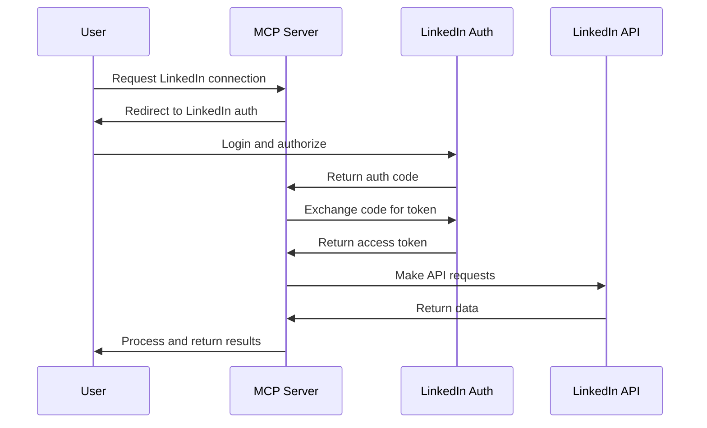

# LinkedIn MCP Server Technical Specification
**Date:** 2025-01-28  
**Version:** 1.0  
**Status:** Research Complete

## Executive Summary

This document provides a comprehensive technical specification for building a LinkedIn MCP (Model Context Protocol) server using only the official LinkedIn API. After extensive research, we've identified significant limitations in LinkedIn's API ecosystem that severely restrict profile management capabilities. The official API is primarily read-only for profile data, with no endpoints available for updating user profiles programmatically.

## Table of Contents
1. [LinkedIn Official API Deep Dive](#1-linkedin-official-api-deep-dive)
2. [MCP Server Architecture](#2-mcp-server-architecture)
3. [Compliance and Legal](#3-compliance-and-legal)
4. [Technical Implementation Plan](#4-technical-implementation-plan)
5. [Limitations and Workarounds](#5-limitations-and-workarounds)
6. [Recommendations](#6-recommendations)

---

## 1. LinkedIn Official API Deep Dive

### 1.1 Current API Products and Tiers

LinkedIn's API ecosystem is highly restricted and requires approval through their Partner Program:

#### Partner Programs Available:
- **Marketing Developer Program**
  - Target: Marketing technology companies
  - Access: Advertising APIs, Campaign Management
  - Requirements: Proven marketing platform with significant user base

- **Sales Navigator Solutions**
  - Target: Sales technology providers
  - Access: Sales Navigator data, lead management
  - Requirements: Existing sales platform with enterprise clients

- **Compliance API**
  - Target: Compliance and legal tech companies
  - Access: Compliance-related data endpoints

#### Approval Process:
- Timeline: 3-6 months average
- Approval rate: Less than 10% of applications
- Requirements:
  - Existing product with proven user base
  - Clear value proposition for LinkedIn users
  - Compliance with data privacy regulations
  - Technical integration capabilities

### 1.2 Authentication Methods

LinkedIn uses OAuth 2.0 with two main flows:

#### 3-Legged OAuth (Authorization Code Flow)
```typescript
// OAuth 2.0 URLs
const AUTHORIZATION_URL = 'https://www.linkedin.com/oauth/v2/authorization';
const TOKEN_URL = 'https://www.linkedin.com/oauth/v2/accessToken';

// Required parameters
interface OAuthParams {
  response_type: 'code';
  client_id: string;
  redirect_uri: string;
  state: string; // CSRF protection
  scope: string; // Space-delimited permissions
}

// Example implementation
class LinkedInOAuth {
  async getAuthorizationUrl(params: OAuthParams): Promise<string> {
    const queryParams = new URLSearchParams({
      response_type: params.response_type,
      client_id: params.client_id,
      redirect_uri: params.redirect_uri,
      state: params.state,
      scope: params.scope
    });
    
    return `${AUTHORIZATION_URL}?${queryParams.toString()}`;
  }
  
  async exchangeCodeForToken(code: string): Promise<AccessToken> {
    // Code expires in 30 minutes - must be used immediately
    const response = await fetch(TOKEN_URL, {
      method: 'POST',
      headers: {
        'Content-Type': 'application/x-www-form-urlencoded',
      },
      body: new URLSearchParams({
        grant_type: 'authorization_code',
        code: code,
        redirect_uri: this.redirectUri,
        client_id: this.clientId,
        client_secret: this.clientSecret,
      }),
    });
    
    return response.json();
  }
}
```

#### 2-Legged OAuth (Client Credentials Flow)
- Use case: Non-member specific APIs
- **NOT available for Marketing APIs**
- Limited to application-level access

### 1.3 Rate Limits and Quotas

Rate limits are NOT publicly documented and vary by:
- Partner tier
- Specific endpoint
- Time of day

**Key Points:**
- Rate limited requests receive HTTP 429 response
- Daily limits visible only in Developer Portal Analytics
- Low quotas reported: ~10 requests per user per 24 hours for some endpoints
- Must make test call to see endpoint limits

### 1.4 Available Endpoints for Profile Management

**Critical Finding:** LinkedIn's official API does NOT support profile updates.

#### Read-Only Profile Endpoints:
```typescript
// Profile data that can be READ (not written)
interface LinkedInProfile {
  id: string;
  firstName: LocalizedString;
  lastName: LocalizedString;
  headline: LocalizedString;
  profilePicture: ProfilePicture;
  vanityName?: string;
  // Note: No update methods available
}

// Example GET request
GET https://api.linkedin.com/v2/me
Authorization: Bearer {access_token}
```

#### Available Write Operations:
1. **Posts API** - Create and manage posts
2. **Comments API** - Create, delete, retrieve comments
3. **Event Management API** - Update event settings
4. **Share API** - Post text, URLs, and media

### 1.5 Cost Structure and Pricing

#### Sales Navigator Pricing (2025):
- **Core Plan:** $99.99/month ($79.99/month annual)
- **Advanced Plan:** $169.99/month ($139.99/month annual)
- **Advanced Plus:** Custom pricing (~$1,600/seat/year)

#### API Access:
- Free for approved partners
- Requires expensive partnership program
- Alternative third-party solutions: Starting at $49/month

### 1.6 API Versioning and Deprecation

LinkedIn uses versioned APIs with the following pattern:
- Version format: `li-lms-2025-06`
- Deprecation notice: Minimum 6 months
- Migration guides provided for breaking changes

---

## 2. MCP Server Architecture

### 2.1 Best Practices for MCP Development

#### Project Structure:
```
linkedin-mcp-server/
├── src/
│   ├── index.ts           # Server entry point
│   ├── server.ts          # MCP server implementation
│   ├── linkedin/
│   │   ├── client.ts      # LinkedIn API client
│   │   ├── auth.ts        # OAuth implementation
│   │   └── types.ts       # TypeScript interfaces
│   ├── tools/             # MCP tools
│   │   ├── profile.ts     # Profile-related tools
│   │   ├── posts.ts       # Post management tools
│   │   └── analytics.ts   # Analytics tools
│   └── resources/         # MCP resources
│       └── profile.ts     # Profile data resources
├── package.json
├── tsconfig.json
└── README.md
```

### 2.2 Required Components

#### Core Dependencies:
```json
{
  "dependencies": {
    "@modelcontextprotocol/sdk": "^1.0.0",
    "zod": "^3.22.0",
    "node-fetch": "^3.3.0"
  },
  "devDependencies": {
    "@types/node": "^20.0.0",
    "typescript": "^5.0.0"
  }
}
```

#### TypeScript Configuration:
```json
{
  "compilerOptions": {
    "target": "ES2022",
    "module": "ES2022",
    "moduleResolution": "node",
    "strict": true,
    "esModuleInterop": true,
    "skipLibCheck": true,
    "forceConsistentCasingInFileNames": true,
    "outDir": "./build",
    "rootDir": "./src"
  },
  "include": ["src/**/*"],
  "exclude": ["node_modules"]
}
```

### 2.3 MCP Server Implementation

```typescript
import { McpServer, StdioServerTransport } from '@modelcontextprotocol/sdk';
import { z } from 'zod';
import { LinkedInClient } from './linkedin/client.js';

export class LinkedInMCPServer {
  private server: McpServer;
  private linkedInClient: LinkedInClient;

  constructor() {
    this.server = new McpServer(
      {
        name: 'linkedin-mcp-server',
        version: '1.0.0',
        description: 'MCP server for LinkedIn integration'
      },
      {
        capabilities: {
          tools: {},
          resources: {}
        }
      }
    );

    this.linkedInClient = new LinkedInClient();
    this.registerTools();
    this.registerResources();
  }

  private registerTools() {
    // Profile reading tool
    this.server.setRequestHandler(
      'tools/getProfile',
      z.object({
        accessToken: z.string(),
        fields: z.array(z.string()).optional()
      }),
      async (request) => {
        const { accessToken, fields } = request.params;
        try {
          const profile = await this.linkedInClient.getProfile(
            accessToken, 
            fields
          );
          return {
            content: [{
              type: 'text',
              text: JSON.stringify(profile, null, 2)
            }]
          };
        } catch (error) {
          return {
            content: [{
              type: 'text',
              text: `Error fetching profile: ${error.message}`
            }],
            isError: true
          };
        }
      }
    );

    // Post creation tool
    this.server.setRequestHandler(
      'tools/createPost',
      z.object({
        accessToken: z.string(),
        text: z.string(),
        visibility: z.enum(['PUBLIC', 'CONNECTIONS']).optional()
      }),
      async (request) => {
        const { accessToken, text, visibility } = request.params;
        try {
          const post = await this.linkedInClient.createPost(
            accessToken,
            text,
            visibility || 'PUBLIC'
          );
          return {
            content: [{
              type: 'text',
              text: `Post created successfully: ${post.id}`
            }]
          };
        } catch (error) {
          return {
            content: [{
              type: 'text',
              text: `Error creating post: ${error.message}`
            }],
            isError: true
          };
        }
      }
    );
  }

  private registerResources() {
    // Profile resource
    this.server.setRequestHandler(
      'resources/profile',
      z.object({
        accessToken: z.string()
      }),
      async (request) => {
        const { accessToken } = request.params;
        const profile = await this.linkedInClient.getProfile(accessToken);
        
        return {
          contents: [{
            uri: `linkedin://profile/${profile.id}`,
            mimeType: 'application/json',
            text: JSON.stringify(profile, null, 2)
          }]
        };
      }
    );
  }

  async start() {
    const transport = new StdioServerTransport();
    await this.server.connect(transport);
    console.error('LinkedIn MCP Server started');
  }
}
```

### 2.4 Error Handling and Retry Mechanisms

```typescript
class RetryableLinkedInClient {
  private maxRetries = 3;
  private retryDelay = 1000; // Start with 1 second

  async executeWithRetry<T>(
    operation: () => Promise<T>,
    retryCount = 0
  ): Promise<T> {
    try {
      return await operation();
    } catch (error) {
      if (this.shouldRetry(error) && retryCount < this.maxRetries) {
        const delay = this.retryDelay * Math.pow(2, retryCount);
        await this.sleep(delay);
        return this.executeWithRetry(operation, retryCount + 1);
      }
      throw error;
    }
  }

  private shouldRetry(error: any): boolean {
    // Retry on rate limits and temporary errors
    return error.status === 429 || 
           error.status === 503 || 
           error.code === 'ECONNRESET';
  }

  private sleep(ms: number): Promise<void> {
    return new Promise(resolve => setTimeout(resolve, ms));
  }
}
```

### 2.5 Caching Strategy

```typescript
interface CacheEntry<T> {
  data: T;
  timestamp: number;
  ttl: number;
}

class LinkedInCache {
  private cache = new Map<string, CacheEntry<any>>();
  
  set<T>(key: string, data: T, ttlSeconds: number = 3600): void {
    this.cache.set(key, {
      data,
      timestamp: Date.now(),
      ttl: ttlSeconds * 1000
    });
  }
  
  get<T>(key: string): T | null {
    const entry = this.cache.get(key);
    if (!entry) return null;
    
    if (Date.now() - entry.timestamp > entry.ttl) {
      this.cache.delete(key);
      return null;
    }
    
    return entry.data;
  }
  
  // Clean expired entries periodically
  startCleanupInterval(intervalMs: number = 60000): void {
    setInterval(() => {
      const now = Date.now();
      for (const [key, entry] of this.cache.entries()) {
        if (now - entry.timestamp > entry.ttl) {
          this.cache.delete(key);
        }
      }
    }, intervalMs);
  }
}
```

### 2.6 Configuration Management

```typescript
interface LinkedInMCPConfig {
  linkedin: {
    clientId: string;
    clientSecret: string;
    redirectUri: string;
    scopes: string[];
  };
  server: {
    port?: number;
    logLevel?: 'debug' | 'info' | 'warn' | 'error';
  };
  cache: {
    enabled: boolean;
    ttl: number;
  };
  rateLimit: {
    maxRetries: number;
    retryDelay: number;
  };
}

// Load from environment variables
function loadConfig(): LinkedInMCPConfig {
  return {
    linkedin: {
      clientId: process.env.LINKEDIN_CLIENT_ID!,
      clientSecret: process.env.LINKEDIN_CLIENT_SECRET!,
      redirectUri: process.env.LINKEDIN_REDIRECT_URI!,
      scopes: (process.env.LINKEDIN_SCOPES || 'r_liteprofile').split(',')
    },
    server: {
      port: parseInt(process.env.PORT || '3000'),
      logLevel: (process.env.LOG_LEVEL || 'info') as any
    },
    cache: {
      enabled: process.env.CACHE_ENABLED !== 'false',
      ttl: parseInt(process.env.CACHE_TTL || '3600')
    },
    rateLimit: {
      maxRetries: parseInt(process.env.MAX_RETRIES || '3'),
      retryDelay: parseInt(process.env.RETRY_DELAY || '1000')
    }
  };
}
```

---

## 3. Compliance and Legal

### 3.1 LinkedIn Platform Program Policies

#### Key Restrictions:
1. **No Scraping**: Automated data collection outside API is prohibited
2. **User Consent**: Explicit consent required for all data collection
3. **Data Usage**: Can only use data for declared purposes
4. **No Caching**: Limited caching allowed (check specific endpoint rules)
5. **Attribution**: Must attribute content to LinkedIn

### 3.2 Data Usage Restrictions

```typescript
// Example consent flow implementation
interface ConsentManager {
  // Must obtain explicit consent before accessing user data
  async requestConsent(userId: string, scopes: string[]): Promise<boolean>;
  
  // Track consent status
  async hasConsent(userId: string, scope: string): Promise<boolean>;
  
  // Allow users to revoke consent
  async revokeConsent(userId: string): Promise<void>;
}

// Data usage tracking
interface DataUsageLogger {
  // Log every API call for compliance
  async logApiCall(params: {
    userId: string;
    endpoint: string;
    purpose: string;
    timestamp: Date;
  }): Promise<void>;
  
  // Generate compliance reports
  async generateComplianceReport(userId: string): Promise<Report>;
}
```

### 3.3 GDPR Compliance

#### Requirements:
1. **Data Minimization**: Only collect necessary data
2. **Purpose Limitation**: Use data only for stated purposes
3. **Storage Limitation**: Delete data when no longer needed
4. **Right to Access**: Provide users their data on request
5. **Right to Deletion**: Delete user data on request
6. **Data Portability**: Export user data in standard format

#### Implementation:
```typescript
class GDPRCompliantStorage {
  // Automatic data deletion
  async setWithExpiry(key: string, data: any, expiryDays: number = 30) {
    const expiryTime = Date.now() + (expiryDays * 24 * 60 * 60 * 1000);
    await this.store.set(key, {
      data,
      expiry: expiryTime,
      purpose: 'profile_management',
      consentDate: new Date()
    });
  }
  
  // Data export for portability
  async exportUserData(userId: string): Promise<UserDataExport> {
    const data = await this.getUserData(userId);
    return {
      format: 'json',
      version: '1.0',
      exportDate: new Date(),
      data: data
    };
  }
  
  // Complete data deletion
  async deleteUserData(userId: string): Promise<void> {
    await this.store.deleteAll(`user:${userId}:*`);
    await this.logDeletion(userId);
  }
}
```

### 3.4 Acceptable Use Cases

#### Approved Uses:
1. **Analytics**: Aggregate data analysis (with consent)
2. **CRM Integration**: Syncing profile data to CRM
3. **Content Publishing**: Creating posts on behalf of users
4. **Lead Generation**: With explicit opt-in

#### Prohibited Uses:
1. **Profile Scraping**: Automated profile data collection
2. **Bulk Messaging**: Automated connection requests or messages
3. **Data Resale**: Selling or sharing LinkedIn data
4. **Competitive Intelligence**: Monitoring competitor employees

---

## 4. Technical Implementation Plan

### 4.1 Step-by-Step OAuth 2.0 Implementation



#### Implementation Steps:

**Step 1: Register LinkedIn App**
```bash
# Required information:
- App Name
- Company
- Privacy Policy URL
- App Logo
- OAuth 2.0 Redirect URLs
```

**Step 2: Implement Authorization Flow**
```typescript
class LinkedInAuth {
  private config: LinkedInMCPConfig;
  
  generateAuthUrl(state: string): string {
    const params = new URLSearchParams({
      response_type: 'code',
      client_id: this.config.linkedin.clientId,
      redirect_uri: this.config.linkedin.redirectUri,
      state: state,
      scope: this.config.linkedin.scopes.join(' ')
    });
    
    return `https://www.linkedin.com/oauth/v2/authorization?${params}`;
  }
  
  async handleCallback(code: string, state: string): Promise<TokenResponse> {
    // Verify state parameter for CSRF protection
    if (!this.verifyState(state)) {
      throw new Error('Invalid state parameter');
    }
    
    const response = await fetch('https://www.linkedin.com/oauth/v2/accessToken', {
      method: 'POST',
      headers: {
        'Content-Type': 'application/x-www-form-urlencoded',
      },
      body: new URLSearchParams({
        grant_type: 'authorization_code',
        code: code,
        redirect_uri: this.config.linkedin.redirectUri,
        client_id: this.config.linkedin.clientId,
        client_secret: this.config.linkedin.clientSecret,
      }),
    });
    
    if (!response.ok) {
      throw new Error(`Token exchange failed: ${response.statusText}`);
    }
    
    return response.json();
  }
}
```

**Step 3: Implement Token Management**
```typescript
interface TokenStorage {
  async saveToken(userId: string, token: TokenResponse): Promise<void>;
  async getToken(userId: string): Promise<TokenResponse | null>;
  async refreshToken(userId: string): Promise<TokenResponse>;
  async revokeToken(userId: string): Promise<void>;
}

class SecureTokenStorage implements TokenStorage {
  private encryption: EncryptionService;
  
  async saveToken(userId: string, token: TokenResponse): Promise<void> {
    const encrypted = await this.encryption.encrypt(JSON.stringify(token));
    await this.store.set(`token:${userId}`, {
      data: encrypted,
      expiresAt: Date.now() + (token.expires_in * 1000)
    });
  }
  
  async getToken(userId: string): Promise<TokenResponse | null> {
    const stored = await this.store.get(`token:${userId}`);
    if (!stored || stored.expiresAt < Date.now()) {
      return null;
    }
    
    const decrypted = await this.encryption.decrypt(stored.data);
    return JSON.parse(decrypted);
  }
}
```

### 4.2 MCP Protocol Integration

**Step 1: Define Available Tools**
```typescript
const TOOLS = [
  {
    name: 'linkedin_get_profile',
    description: 'Fetch LinkedIn profile information',
    inputSchema: {
      type: 'object',
      properties: {
        userId: { type: 'string', description: 'LinkedIn user ID' },
        fields: { 
          type: 'array', 
          items: { type: 'string' },
          description: 'Profile fields to retrieve'
        }
      },
      required: ['userId']
    }
  },
  {
    name: 'linkedin_create_post',
    description: 'Create a LinkedIn post',
    inputSchema: {
      type: 'object',
      properties: {
        text: { type: 'string', description: 'Post content' },
        visibility: { 
          type: 'string', 
          enum: ['PUBLIC', 'CONNECTIONS'],
          description: 'Post visibility'
        }
      },
      required: ['text']
    }
  },
  {
    name: 'linkedin_get_connections',
    description: 'Retrieve user connections (limited by API)',
    inputSchema: {
      type: 'object',
      properties: {
        start: { type: 'number', description: 'Pagination start' },
        count: { type: 'number', description: 'Number of results' }
      }
    }
  }
];
```

**Step 2: Implement Tool Handlers**
```typescript
class LinkedInToolHandlers {
  async handleGetProfile(params: any): Promise<ToolResponse> {
    try {
      const token = await this.tokenStorage.getToken(params.userId);
      if (!token) {
        return {
          error: 'No valid token found. Please authenticate first.'
        };
      }
      
      const profile = await this.linkedInClient.getProfile(
        token.access_token,
        params.fields
      );
      
      return {
        result: profile,
        metadata: {
          timestamp: new Date().toISOString(),
          rateLimit: this.getRateLimitInfo()
        }
      };
    } catch (error) {
      return {
        error: error.message,
        details: error.stack
      };
    }
  }
}
```

### 4.3 Testing Strategy

**Unit Tests:**
```typescript
describe('LinkedInMCPServer', () => {
  let server: LinkedInMCPServer;
  let mockLinkedInClient: jest.Mocked<LinkedInClient>;
  
  beforeEach(() => {
    mockLinkedInClient = createMockLinkedInClient();
    server = new LinkedInMCPServer(mockLinkedInClient);
  });
  
  describe('Profile Operations', () => {
    test('should fetch profile successfully', async () => {
      const mockProfile = {
        id: '123',
        firstName: { localized: { en_US: 'John' } },
        lastName: { localized: { en_US: 'Doe' } }
      };
      
      mockLinkedInClient.getProfile.mockResolvedValue(mockProfile);
      
      const result = await server.handleTool('linkedin_get_profile', {
        userId: 'test-user'
      });
      
      expect(result.result).toEqual(mockProfile);
      expect(mockLinkedInClient.getProfile).toHaveBeenCalledWith(
        expect.any(String),
        undefined
      );
    });
    
    test('should handle API errors gracefully', async () => {
      mockLinkedInClient.getProfile.mockRejectedValue(
        new Error('Rate limit exceeded')
      );
      
      const result = await server.handleTool('linkedin_get_profile', {
        userId: 'test-user'
      });
      
      expect(result.error).toBe('Rate limit exceeded');
    });
  });
});
```

**Integration Tests:**
```typescript
describe('LinkedIn OAuth Flow', () => {
  test('should complete full OAuth flow', async () => {
    // Test authorization URL generation
    const authUrl = auth.generateAuthUrl('test-state');
    expect(authUrl).toContain('client_id=');
    expect(authUrl).toContain('redirect_uri=');
    expect(authUrl).toContain('state=test-state');
    
    // Test callback handling
    const mockCode = 'test-auth-code';
    nock('https://www.linkedin.com')
      .post('/oauth/v2/accessToken')
      .reply(200, {
        access_token: 'test-token',
        expires_in: 3600
      });
    
    const token = await auth.handleCallback(mockCode, 'test-state');
    expect(token.access_token).toBe('test-token');
  });
});
```

### 4.4 Documentation Requirements

**API Documentation Template:**
```markdown
# LinkedIn MCP Server API Documentation

## Authentication

All requests require authentication via OAuth 2.0.

### Getting Started
1. Configure OAuth credentials in environment variables
2. Direct users to authorization URL
3. Handle callback and store tokens

## Available Tools

### linkedin_get_profile
Retrieves LinkedIn profile information.

**Parameters:**
- `userId` (string, required): LinkedIn user ID
- `fields` (array, optional): Specific fields to retrieve

**Response:**
```json
{
  "id": "urn:li:person:123",
  "firstName": {...},
  "lastName": {...},
  "headline": {...}
}
```

**Rate Limits:** Varies by partner tier

### linkedin_create_post
Creates a new LinkedIn post.

**Parameters:**
- `text` (string, required): Post content
- `visibility` (string, optional): PUBLIC or CONNECTIONS

**Response:**
```json
{
  "id": "urn:li:share:123",
  "status": "published"
}
```

## Error Handling

| Error Code | Description | Action |
|------------|-------------|---------|
| 401 | Unauthorized | Re-authenticate user |
| 429 | Rate limited | Retry with backoff |
| 500 | Server error | Retry with backoff |
```

---

## 5. Limitations and Workarounds

### 5.1 What Profile Updates are NOT Possible

**Cannot Update via Official API:**
- ❌ Profile headline
- ❌ About/Summary section
- ❌ Work experience
- ❌ Education
- ❌ Skills
- ❌ Certifications
- ❌ Profile photo
- ❌ Banner image
- ❌ Contact information
- ❌ Custom profile sections

**What IS Possible:**
- ✅ Read profile data
- ✅ Create posts/shares
- ✅ Comment on posts
- ✅ Create/manage events
- ✅ Limited analytics access

### 5.2 Alternative Compliant Approaches

#### Option 1: Hybrid Web Extension + API
```typescript
// Browser extension for profile updates
class LinkedInProfileExtension {
  // Extension injects scripts into LinkedIn pages
  async updateProfileField(field: string, value: string) {
    // Use DOM manipulation on linkedin.com
    // Requires user to be logged in and on profile page
  }
}

// MCP server coordinates with extension
class HybridMCPServer {
  async requestProfileUpdate(updates: ProfileUpdates) {
    // 1. Store update request
    await this.queueUpdate(updates);
    
    // 2. Notify extension via native messaging
    await this.notifyExtension(updates);
    
    // 3. Extension performs updates when user visits LinkedIn
    // 4. Extension confirms completion
  }
}
```

#### Option 2: Guided Manual Process
```typescript
interface ProfileUpdateGuide {
  generateInstructions(updates: ProfileUpdates): Instruction[];
  trackProgress(userId: string): UpdateProgress;
  provideScreenshots(): Screenshot[];
}

class GuidedUpdateService {
  async createUpdateGuide(updates: ProfileUpdates): Promise<Guide> {
    return {
      steps: [
        {
          number: 1,
          action: 'Navigate to LinkedIn profile',
          screenshot: '/assets/profile-navigation.png',
          fields: ['Click on "Me" icon', 'Select "View Profile"']
        },
        {
          number: 2,
          action: 'Edit headline',
          screenshot: '/assets/edit-headline.png',
          fields: ['Click pencil icon', 'Update text', 'Save']
        }
      ],
      estimatedTime: '5 minutes',
      trackingCode: generateTrackingCode()
    };
  }
}
```

#### Option 3: LinkedIn-Compliant Automation Tools
```typescript
// Use LinkedIn's official tools where available
class LinkedInToolsIntegration {
  // Sales Navigator API for sales-related updates
  async updateSalesPreferences(preferences: SalesPreferences) {
    // Limited but compliant
  }
  
  // Campaign Manager for marketing
  async updateMarketingProfile(profile: MarketingProfile) {
    // Marketing-specific updates
  }
}
```

### 5.3 Hybrid Solutions

**Architecture for Hybrid MCP Server:**
```
┌─────────────────────────────────────────────┐
│            MCP Client (AI Agent)            │
└─────────────────┬───────────────────────────┘
                  │
┌─────────────────▼───────────────────────────┐
│            LinkedIn MCP Server              │
│  ┌─────────────────┬─────────────────────┐  │
│  │   API Module    │   Automation Module │  │
│  │                 │                     │  │
│  │ - Read Profile  │ - Queue Updates     │  │
│  │ - Create Posts  │ - Generate Guides   │  │
│  │ - Analytics     │ - Track Progress    │  │
│  └─────────────────┴─────────────────────┘  │
└─────────────────────────────────────────────┘
                  │
     ┌────────────┴────────────┐
     │                         │
┌─────▼──────┐          ┌──────▼──────┐
│LinkedIn API│          │Web Extension│
│  (Official)│          │  (Browser)  │
└────────────┘          └─────────────┘
```

**Implementation Example:**
```typescript
class HybridLinkedInMCPServer {
  async handleProfileUpdate(request: ProfileUpdateRequest): Promise<Response> {
    // Check what can be done via API
    const apiCapabilities = this.checkApiCapabilities(request);
    
    if (apiCapabilities.fullySupported) {
      // Use API directly
      return this.updateViaApi(request);
    } else if (apiCapabilities.partiallySupported) {
      // Hybrid approach
      const apiUpdates = await this.updateViaApi(apiCapabilities.supported);
      const manualUpdates = this.generateManualGuide(apiCapabilities.unsupported);
      
      return {
        status: 'partial',
        completed: apiUpdates,
        manual: manualUpdates
      };
    } else {
      // Full manual guidance
      return {
        status: 'manual',
        guide: this.generateCompleteGuide(request),
        automation: 'Consider browser extension for automation'
      };
    }
  }
}
```

---

## 6. Recommendations

### 6.1 Realistic Assessment

Based on comprehensive research, building a LinkedIn MCP server for profile management using only the official API is **severely limited**. The official API does not support profile updates, making it unsuitable for a profile management tool.

### 6.2 Recommended Approach

#### For Reading Profile Data:
1. **Implement MCP server with read-only capabilities**
2. **Focus on analytics and insights**
3. **Integrate with CRM systems**

#### For Profile Updates:
1. **Option A: Browser Extension**
   - Build a browser extension for profile updates
   - Use MCP server for coordination and API operations
   - Maintain compliance through user-initiated actions

2. **Option B: Guided Manual Process**
   - Generate detailed update instructions
   - Track progress through user confirmation
   - Provide value through organization and tracking

3. **Option C: Third-Party Services**
   - Consider approved third-party APIs
   - Evaluate compliance and cost implications
   - Ensure data privacy standards

### 6.3 Implementation Priority

1. **Phase 1: Read-Only MCP Server**
   - Profile data retrieval
   - Post creation and management
   - Analytics and reporting

2. **Phase 2: Hybrid Extensions**
   - Browser extension development
   - Native messaging integration
   - Update queue management

3. **Phase 3: Enhanced Features**
   - AI-powered content suggestions
   - Bulk operations (where compliant)
   - Advanced analytics

### 6.4 Compliance Checklist

- [ ] Register for LinkedIn Partner Program
- [ ] Implement proper OAuth 2.0 flow
- [ ] Add comprehensive consent management
- [ ] Implement GDPR compliance features
- [ ] Set up rate limit monitoring
- [ ] Create detailed audit logs
- [ ] Prepare data deletion procedures
- [ ] Document all data usage

### 6.5 Technical Stack Recommendation

```yaml
Core:
  - TypeScript 5.0+
  - @modelcontextprotocol/sdk
  - Node.js 20 LTS

Authentication:
  - passport-linkedin-oauth2
  - secure-token-storage

Data Management:
  - Redis (caching)
  - PostgreSQL (persistent storage)
  - encryption-at-rest

Monitoring:
  - Prometheus (metrics)
  - Grafana (dashboards)
  - Sentry (error tracking)

Testing:
  - Jest (unit tests)
  - Supertest (integration tests)
  - Cypress (E2E tests)
```

---

## Conclusion

Building a LinkedIn MCP server using only the official API is technically feasible but functionally limited. The inability to update profiles through the API necessitates creative hybrid solutions. The recommended approach is to build a read-only MCP server for data retrieval and analytics, supplemented by either a browser extension or guided manual process for profile updates.

Success depends on:
1. Obtaining LinkedIn Partner Program approval
2. Implementing robust compliance measures
3. Setting realistic expectations about capabilities
4. Providing value through available features
5. Considering hybrid solutions for full functionality

The technical implementation is straightforward, but the business and compliance challenges are significant. Organizations should carefully evaluate whether the limited official API capabilities meet their needs before investing in development.